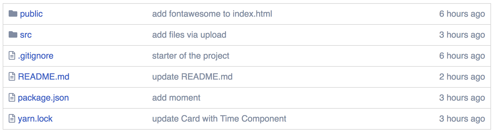

## GitHub Project

This is a simple GitHub repo page. 

It displays the repo's documents by files and folders and also shows the last commit time and message.

## Project Screenshot 

## Instructions for installment

- clone my repo git clone https://github.com/mavisluan/github
- install all project dependencies with yarn install
- start the development server with yarn start

